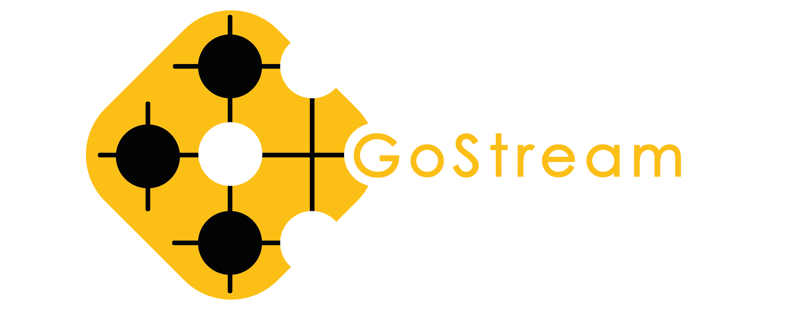

<div align="center">
    
    <h1>GOGAME DETECTION</h1>

<h3>Developed with the software and tools below</h3>
<p align="center">
    
    
    
    
    
    
    
    
    
    
</p>
</div>

---

## Table of Contents
- [Overview Year 1](#-overview-year-1)
- [Overview Year 2](#-overview-year-2)
- [Repository Structure](#repository-structure)
- [Getting Started](#getting-started)
    - [Installation](#installation)
    - [Running GoGame-Detection](#running-gogame-detection)
- [Roadmap](#roadmap)
- [Acknowledgments](#acknowledgments)


---


## 📍 Overview Year 1

This project is a part of the engineering curriculum in the french engineering school IMT Atlantique (Brest), specifically "UE Projet Commande Entreprise".
It is dedicated to the development of a program capable of recognizing a game board, its stones and their respective positions within a go game context from a video stream.
The primary problem that our project tackles is the detection of the game setup at different angles without the need to set the camera at a fixed configuration. This capability allows for flexibility in changing the camera's angle or position, as well as adjusting the game board's placement during the course of the game. This stands as a distinctive feature compared to many existing solutions.


Key Highlights:
- **Real-time Game recognition:** Capable of detecting key components of a go game using a custom trained `Yolov8` model.
- **Game management:** Capable of streaming and visually reproducing a Go game with or without respecting the Go game rules.
- **SGF:** Capable of saving an SGF file of the streamed game for later use. 
- .
- **Intuitive Visualization:** An interactive user interface has been developed on the base of this project. The interface takes the form of a website which works only locally.

## 📍 Overview Year 2

In Year 2, the GoGame-Detection project was enhanced by adding new features to improve reliability, accuracy, and autonomy. We focused on refining the detection process and introducing a post-treatment phase to correct errors after the game ends.

Key Highlights:
- **Transparent Mode:**
Introduced an updated transparent mode for real-time game board detection without blocking rules.

- **Post-treatment Algorithms and AI:**
Added AI-based post-treatment functions to automatically correct detection errors after the game, improving the system’s autonomy and accuracy (Post_treatment_AI)
Added also algorithm-base and hybrid-based post-treatment functions
(Post_treatment_Algo)

---

## 📂 Repository Structure

```sh

├── Annex
├── Go-Game-Streaming-WebApp-main
├── GoBoard.py
├── GoGame.py
├── GoVisual.py
├── Historique_test_js.html
├── Post_treatment_AI
│   ├── Code
│   │   ├── Fill_gaps_model.py
│   │   └── modelCNN.keras
│   ├── Notebook Model.ipynb
│   └── Test
├── Post_treatment_Algo
│   ├── Code
│   │   ├── corrector_noAI.py
│   │   ├── corrector_withAI.py
│   │   └── sgf_to_numpy.py
│   └── Test
├── README.md
├── empty_board.jpg
├── historiquejs.js
├── main.py
├── model.pt
├── recup_os.py
├── requirements.txt
├── static
└── utils_.py

```

---

## 🚀 Getting Started

***Dependencies***

The code is runnable under Python3.10 (and not more recent versions for now).
Please ensure you have the following dependencies installed on your system:

ℹ️ [TensorFlow](https://pypi.org/project/tensorflow/) (version 2.17.0)

ℹ️ [Flask](https://pypi.org/project/Flask/) (version 3.1.0)

ℹ️ [numpy](https://pypi.org/project/numpy/) (version <2)

ℹ️ [opencv-contrib-python](https://pypi.org/project/opencv-contrib-python/) (version 4.8.1.78)

ℹ️ [opencv-python](https://pypi.org/project/opencv-python/) (version 4.10.0.84)

ℹ️ [opencv-python-headless](https://pypi.org/project/opencv-python-headless/) (version 4.10.0.84)

ℹ️ [scikit-learn](https://scikit-learn.org/stable/install.html) (version 1.6.0)

ℹ️ [sente](https://pypi.org/project/sente/) (version 0.4.2)

ℹ️ [sgf](https://pypi.org/project/sgf/) (version 0.5)

ℹ️ [ultralytics](https://pypi.org/project/ultralytics/) (version 8.0.206)

### 🔧 Installation

- **Cloning the Repositories:**

If you are working with **GoGame-Detection** repository:

1. Clone the **GoGame-Detection** repository:
```sh
git clone https://github.com/GoGame-Recognition-Project/GoGame-Detection.git
```

2. Change to the project directory:
```sh
cd GoGame-Detection
```    

If you are working with **TenukiGo** repository:

1. Clone the **TenukiGo** repository:
```sh
git clone https://github.com/Borishkof/TenukiGo.git
```

2. Change to the project directory:
```sh
cd TenukiGo
```    


3. Install the dependencies:
```sh
pip install -r requirements.txt
```


### 🤖 Running the script

```sh
python main.py
```

---


[**Return**](#Top)

---
